# 🎓 RUET Connect - Intelligent Campus Management Platform

<div align="center">

[](https://git.io/typing-svg)


> *"Heaven's light is our guide"*  

**🏛️ Rajshahi University of Engineering & Technology (RUET)**  
**💻 Department of Computer Science & Engineering**


<br>


---

### 👨‍💻 **Developer Profile**

<table>
<tr>
<td align="center">

<br>

<br>

</td>
</tr>
</table>

### 📧 **Connect With Me**

<div align="center">

[](mailto:kafikustori@gmail.com)
[](https://www.linkedin.com/in/abdullah-hal-kafi-nafees-0948b220a)

**📱 WhatsApp Contact**  


</div>

</div>

<br>

## 🏗️ **Project Architecture**

<div align="center">


</div>

<br>

## 🖼️ **Application Showcase**

<div align="center">


<table style="border: none;">
<tr>
<td width="50%" align="center" style="border: none; padding: 20px;">
  <div style="border-radius: 15px; overflow: hidden; box-shadow: 0 10px 30px rgba(0,0,0,0.3);">
    
  </div>
  <br>
  
</td>
<td width="50%" align="center" style="border: none; padding: 20px;">
  <div style="border-radius: 15px; overflow: hidden; box-shadow: 0 10px 30px rgba(0,0,0,0.3);">
    
  </div>
  <br>
  
</td>
</tr>
<tr>
<td width="50%" align="center" style="border: none; padding: 20px;">
  <div style="border-radius: 15px; overflow: hidden; box-shadow: 0 10px 30px rgba(0,0,0,0.3);">
    
  </div>
  <br>
  
</td>
<td width="50%" align="center" style="border: none; padding: 20px;">
  <div style="border-radius: 15px; overflow: hidden; box-shadow: 0 10px 30px rgba(0,0,0,0.3);">
    
  </div>
  <br>
  
</td>
</tr>
</table>

</div>

<br>

## 🚀 **Project Vision**

<div align="center">


</div>

### 🎯 **The Problem We Solved**
```diff
- Important notices scattered across multiple platforms
- Event information poorly communicated  
- No single place for workshops and club activities
- Manual, outdated communication methods
+ Centralized digital hub for all campus activities
+ Real-time updates and notifications
+ Interactive community features
+ Modern, intuitive user experience
```

<br>

## ✨ **What Sets RUET Connect Apart**

<div align="center">


</div>

### 🔐 **Intelligent Role-Based Architecture**

<table>
<tr>
<td width="50%">

**👨‍🎓 Students**
- ✅ Comprehensive browsing
- ✅ Advanced search capabilities  
- ✅ Community-driven upvoting
- ✅ Seamless content engagement

</td>
<td width="50%">

**👨‍💼 Administrators**  
- ✅ Complete content lifecycle management
- ✅ Intuitive administrative interface
- ✅ Real-time content publishing
- ✅ Engagement analytics

</td>
</tr>
</table>

### 📱 **Feature Highlights**

<div align="center">

| 📢 **Notice System** | 🎉 **Event Management** | 🛠️ **Workshop Portal** | 🏛️ **Club Directory** |
|:---:|:---:|:---:|:---:|
| 5-category classification | Community voting system | Complete information portal | Advanced search & sorting |
| Integrated hyperlinks | Direct registration | Registration link management | Popularity-based ranking |
| Real-time delivery | Intelligent search | Community engagement | Discovery platform |

</div>

<br>

## 🛠️ **Technology Stack**

<div align="center">


<br><br>

| **Frontend** | **Backend** | **Development** |
|:---:|:---:|:---:|
|  |  |  |
|  |  |  |
|  |  |  |

</div>

<br>

## 📊 **RUET Connect vs Traditional Platforms**

<div align="center">

| Feature | Traditional Platforms | RUET Connect |
|:---:|:---:|:---:|
| **Cost** | ❌ Expensive | ✅ Free |
| **Design** | ❌ Commercial-focused | ✅ Academic-focused |
| **Complexity** | ❌ Over-engineered | ✅ Simple & Intuitive |
| **Customization** | ❌ Generic | ✅ University-tailored |
| **Learning Curve** | ❌ Steep | ✅ User-friendly |

</div>

<br>

## 🎨 **User Journey**

```mermaid
graph LR
    A[🚪 Registration] --> B[🏠 Dashboard]
    B --> C[🔍 Discover]
    C --> D[💬 Interact]
    D --> E[🔔 Updates]
    
    F[🔐 Admin Login] --> G[📊 Admin Panel]
    G --> H[📝 Create Content]
    H --> I[📤 Publish]
    I --> J[📈 Analytics]
```

<div align="center">



</div>

<br>

## 🚀 **Roadmap**

<div align="center">


</div>

- [ ] 🔔 Push notification infrastructure
- [ ] 📝 Comprehensive feedback system  
- [ ] ⭐ Advanced bookmarking functionality
- [ ] 🔒 Granular permission management
- [ ] 🎨 Enhanced UI/UX optimizations
- [ ] 📊 Analytics dashboard

<br>

## 🎯 **Project Impact**

<div align="center">


</div>

### **Key Accomplishments**
- 🎯 Centralized campus information architecture
- 🔒 Robust role-based access control
- 💫 Interactive community features
- 🏗️ Scalable system architecture
- ⚡ Powerful content management tools

<br>

## 🤝 **Academic Context**

<div align="center">


**👨‍🏫 Academic Supervision:** Md. Sozib Hossain, Lecturer, CSE Department, RUET

</div>

<br>

## 💡 **Learning Outcomes**

> RUET Connect demonstrates how modern mobile development frameworks can strategically resolve traditional communication barriers in academic institutions, establishing a foundation for more connected campus communities.

<br>

## 🏛️ **Built with ❤️ for RUET**

<div align="center">


[](https://github.com/yourusername/ruet-connect)
[](https://ruet.ac.bd)

</div>
